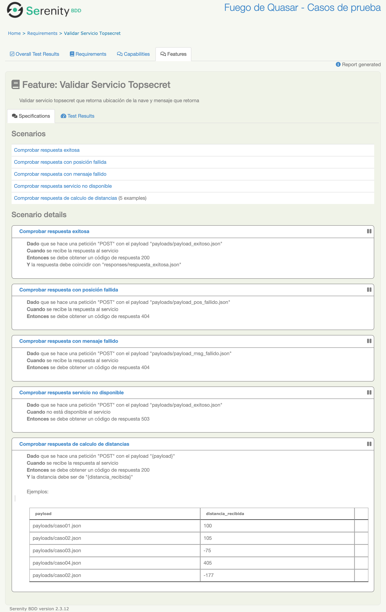

# Fuego de Quasar - Casos de prueba
Ejemplo de casos de prueba para aplicación Fuego de Quasar

A cotinuación se mencionan algunos de los casos de prueba propuestos para probar la aplicación de 
ejemplo para el Fuego de Quasar

Se está utilizando Gherkin como lenguaje de diseño de casos de prueba para que sea una documentación 
viva y que nos sirva como base de una posible automatización de los mismos casos de prueba.


Se ha utilizado como base el repositorio de pruebas de Serenity BDD para restassured cuya información se encuentra en :
([https://github.com/serenity-bdd/serenity-rest-starter](https://github.com/serenity-bdd/rest-cucumber4-starter))

## Estructura de los casos de prueba
* Existen tres archivos de características (feature) en donde encontramos los casos de prueba propuestos para el ejercicio.
* Existe una carpeta Payloads, donde ponemos los archivos json que vamos a utilizar como input para el consumo de los servicios.
* Existe una carpeta responses, donde encontramos las respuestas posibles para comparar el resultado de la ejecución. 
```Gherkin
src
  + main
  + test
    + java                               
    + resources
      + features.Meli                          
        + check_status_app.feature        Casos de prueba para validar salud de la aplicación
        + topsecret.feature               Casos de prueba para validación de servicio topsecret
        + topsecret_split.feature         Casos de prueba para validación de servicio topsecret_split
      + payloads                    Carpeta que contiene los payloads para input
      + responses                   Carpeta con json de respuestas posibles
  

```

## Casos de prueba "Esquema de escenario" (Outline Scenario)

Son casos de prueba que nos permiten desde una misma sentencia realizar múltiples ejecuciones con diferentes datos de entrada, incluso con diferentes posibles respuestas.

````gherkin
 Scenario Outline: Comprobar respuesta de calculo de distancias
    Given que se hace una petición "POST" con el payload "<payload>"
    When se recibe la respuesta al servicio
    Then se debe obtener un código de respuesta 200
    And la distancia debe ser de "<distancia_recibida>"
    Examples:
      | payload              | distancia_recibida |
      | payloads/caso01.json | 100                |
      | payloads/caso02.json | 105                |
      | payloads/caso03.json | -75                |
      | payloads/caso04.json | 405                |
      | payloads/caso02.json | -177               |
      
      
````


## Reportes 

A continuación un ejemplo de lo que podemos obtener al hacer la ejecución de los casos de prueba mencionados, gracias a la utilización del framework de Serenity.

